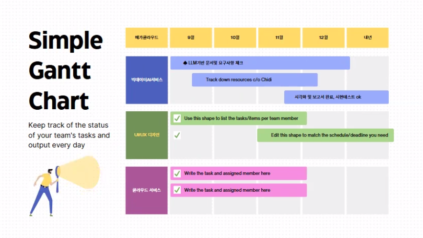
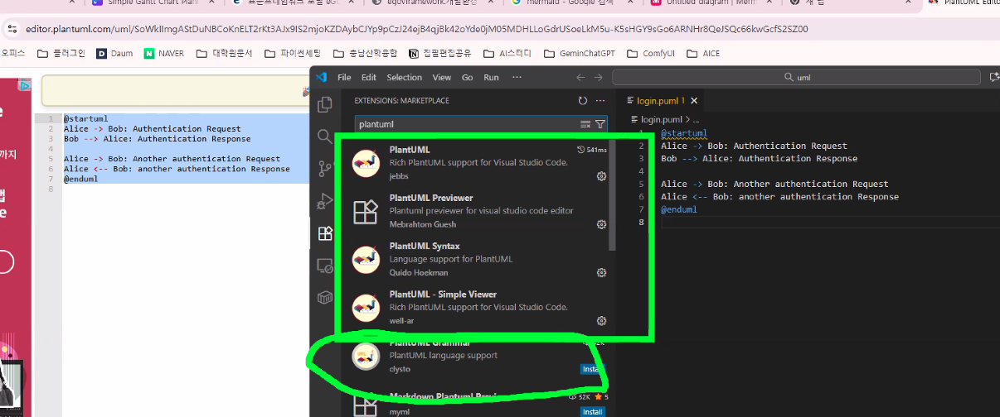

# 💻 실습 준비 가이드

## 1️⃣ 자바 (Java) 설치

* 구글에서 `jdk-8u202-windows-x64.exe` 검색
* 또는 [Oracle Java SE 8 아카이브 다운로드 페이지](https://www.oracle.com/kr/java/technologies/javase/javase8-archive-downloads.html) 방문

---

## 2️⃣ KoNLPy 설치

> ⚠️ KoNLPy는 **Java 설치 후** 가능

### 방법 1) 공식 사이트 다운로드

[https://konlpy.org/ko/latest/install/#id2](https://konlpy.org/ko/latest/install/#id2)

### 방법 2) 명령어 설치

```bash
pip install konlpy
```

---

## 3️⃣ MySQL 설치

* [공식 다운로드 사이트](https://www.mysql.com/)
* [MySQL Tutorial 공식문서](https://www.mysqltutorial.org/)

---

## 4️⃣ 캔바 (Canva)

* **간트차트(Gantt Chart)** 제작 시 유용
  → 프로젝트 진행상황 보고자료용으로 활용 가능

---

## 5️⃣ UML Work

UML 다이어그램 작성 시 유용한 도구

---

# 🧭 Git 실습

> 명령어는 **cmd (콘솔창)** 에서 입력합니다.

### 1. 원격 레포지토리 생성

```bash
https://github.com/깃헙이름/레포지토리이름
```

### 2. 원격 ↔ 로컬 레포지토리 연결

```bash
git remote add origin https://github.com/깃헙이름/레포지토리이름
```

### 3. 현재 연결된 사용자 확인

```bash
git config --global user.email
git config --global user.name
```

### 4. 로컬 저장소 초기화

```bash
git init
```

### 5. 로컬 → 원격 업로드

```bash
git add .
git commit -m "커밋 메시지"
git push origin 브랜치이름
```

---

# 📊 간트차트 (Gantt Chart)

* **Canva**를 이용해 시각적으로 제작 가능
* 프로젝트 일정 및 진행상황 시각화에 적합



---

# 🧩 UML

### 1.설치

```bash
brew install graphviz
```

### 2. 참고

[PlantUML 공식 사이트](https://plantuml.com/ko/)

> 간단한 텍스트를 이용해 멋진 UML 다이어그램을 만들 수 있는 오픈소스 도구입니다.

- puml 유용한 라이브러리


- 정부 표준 프레임워크
[표준프레임워크 포털 eGovFrame](https://www.egovframe.go.kr/home/main.do)

[egovframework:dev4.3    [eGovFrame]](https://www.egovframe.go.kr/wiki/doku.php?id=egovframework:dev4.3)


---

# 🌐 HTML / CSS / JavaScript

* SPA(Single Page Application) 주요 프레임워크:

  * **Angular** (롯데)
  * **Vue.js** (삼성, KT)
  * **React**
  * **Svelte**

---

# 🗃️ SQL

* 관계형 DB: **Oracle, MySQL, SQLite**
* NoSQL: **MongoDB, Firebase**

---

# ⚙️ Backend

* **FastAPI**

---

# 🎨 Frontend

* **Flutter**

---
